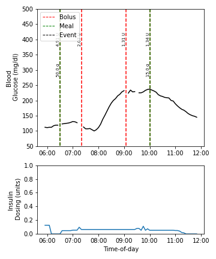
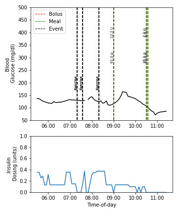

# OpenAPS Data Cleaner

OpenAPS Data Cleaner is a Python package for extracting log data from the OpenAPS Data Commons repository and processing it for time-series analysis and machine learning applications.

<table>
  <tr>
    <td></td>
    <td></td>
  </tr>
</table>

## Introduction

The OpenAPS Data Commons is a centralised repository for facilitating the sharing of type 1 diabetes (T1D) data. People with T1D using do-it-yourself artificial pancreas systems can contribute their anonymised diabetes data to the repository for research purposes. The uploaded data is very detailed and typically consists of the automated device logs from continuous glucose monitors and insulin pumps. 

The code in this repository provides a complete workflow for extracting relevant diabetes metrics from the OpenAPS data commons and processing them into a complete time-series dataset. The final dataset represents one of the richest free-living T1D datasets and contains blood glucose, carbohydrate and insulin information, with additional binary labels of important diabetes control events, such as physical activity, fatty meals and alcohol consumption.     

## Features

Here is a detailed list of the dataset features

- :hourglass: Over 18 combined years of diabetes data.
- :drop_of_blood: Full blood glucose, carbohydrate and insulin information.
- :runner: Binary labels of physical activity, fatty meals, high protein meals, alcohol and caffeine.
- :white_haired_man: Participant demographic information, such as weight, height and age. 
- :toolbox: Compatible with machine learning, deep learning and reinforcement learning tools. 

## Getting Started

A request for access to the OpenAPS data Commons can be made through the [OpenAPS Data Commons Website](https://openaps.org/outcomes/data-commons/). Upon successful application, access should be granted to both the n=183 participant repository and the corresponding demographic file. Raw data files should then be unzipped in order to be compatible with the package.

### Installation

All python dependences are in ```environment.yml```. Install with:

```
conda env create -f environment.yml 
conda activate open_aps
pip3 install -e .
```

## Usage

Package utility can be broadly divided into processing and segmentation.

### Processing

Processing the repository creates two dataframes, one containing the insulin, carbohydrate and blood glucose information from the participant cohort and the other containing binary labels of glucose control events. This function can be run using the following command from within the root folder:
```
python cleaner/main_proc.py
```

Only certain participants in the OpenAPS Data Commons have pump devices that log all the insulin doses delivered by their systems. The IDs of these participants are stored in ```pts.txt``` and are selectively filtered when creating the dataset. Configuration information for dataset processing and segmentation can be found in ```/configs``` folders.


### Segmentation

Segmentation combines the processed data and breaks it into continuous segments for machine learning or reinforcement learning tasks. This function can be run from the root folder using:
```
python cleaner/main_segment.py
```

The function outputs two dictionaries with keys corresponding to the features of a Markov decision process:
- "observations" - the participant's blood glucose, insulin and carbydrates
- "actions" - insulin dosing actions of the participant's blood glucose controller
- "rewards" - how positive a given state or action is for a participant's health
- "terminals" - whether the actions of the controller result in patient hospitalisation

The "rewards" and "observations" representations are determined by functions described in ```feature_rep.py``` and can be readily modified to incorporate new information. To use the data for time-series prediction, the "observations" metric represents a continuous sequence and therefore can be used as both an input and target for blood glucose forecasting. The second dictionary output by the model represents the "observations" without processing.

## Directory Structure

Below is the basic project structure:

```
|- config/                (default configurations for processing & segmentation)
|- datasets/    
|- images/          
|- cleaner/ 
	|- demographic.py	  (processing of patient demographic info)
	|- feature_rep.py	  (representation of model features)
	|- helper.py		  (general support functions)
	|- main_proc.py		  (main processing function)
	|- main_segment.py	  (main segmentation function)
	|- quant_proc.py	  (tools for processing quantitative metrics)
	|- qual_proc.py		  (tools for processing qualitative self-reports)
	|- visualise.py           (view the processed data)
```

## Acknowledgments

We would like to thank the administrator of the OpenAPS data commons, Dana Lewis, for providing access to the repository and answering our questions about the contents of the repository. 